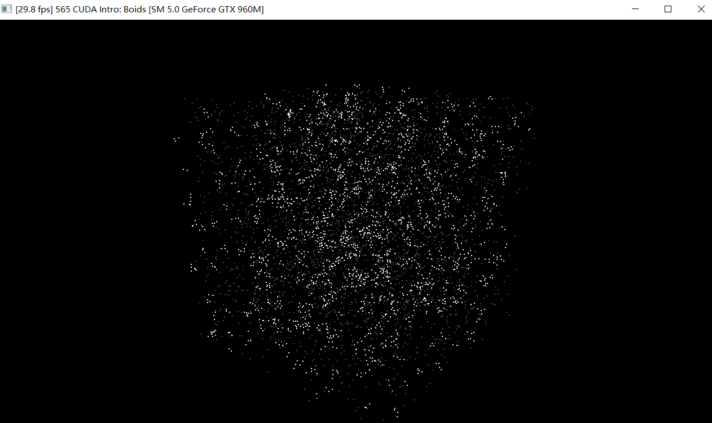

**University of Pennsylvania, CIS 565: GPU Programming and Architecture,
Project 1 - Flocking**

* Xinyu Lin
[Linkedin](https://www.linkedin.com/in/xinyu-lin-138352125/)
* Tested on: Windows 10, Intel64 Family 6 Model 94 Stepping 3 GenuineIntel ~2600 Mhz, 16GB, GTX960M(Private Computer)

### Screenshot of flocking boids

