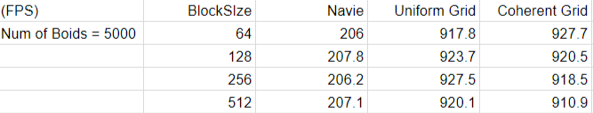

**University of Pennsylvania, CIS 565: GPU Programming and Architecture,
Project 1 - Flocking**

* Xinyu Lin
[Linkedin](https://www.linkedin.com/in/xinyu-lin-138352125/)
* Tested on: Windows 10, Intel64 Family 6 Model 94 Stepping 3 GenuineIntel ~2600 Mhz, 16GB, GTX960M(Private Computer)

### Screenshot of flocking boids

### Performance Analysis

* Framerate change with increasing number of boids

* Framerate change with increasing block size in 5000 boids

### Questions
1. For each implementation, how does changing the number of boids affect performance? Why do you think this is?

* With the increasing number of boids, framerate and performance decrease. Because program needs to check each boid's neighborhoods and the times of checking increases.

2. For each implementation, how does changing the block count and block size affect performance? Why do you think this is?

* The block size and block cound does not affect perforance at all.

3. For the coherent uniform grid: did you experience any performance improvements with the more coherent uniform grid? Was this the outcome you expected? Why or why not?

* No, in my code, the coherent uniform grid is of the same speed as the uniform grid.
  No, the performance of coherent uniform grid is expected to be better than uniform grid.

4. Did changing cell width and checking 27 vs 8 neighboring cells affect performance? Why or why not? Be careful: it is insufficient (and possibly incorrect) to say that 27-cell is slower simply because there are more cells to check!

* Yes, because the way we use to check 27 or 8 neighboring cells is a for-loop in each thread, so the increase of checking area will slow down the performance.
